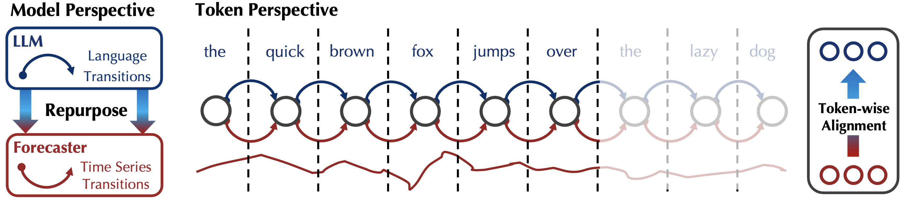
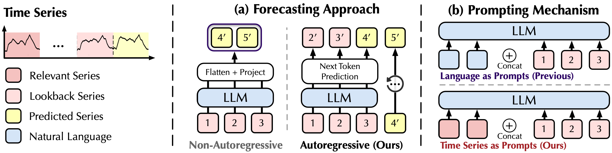
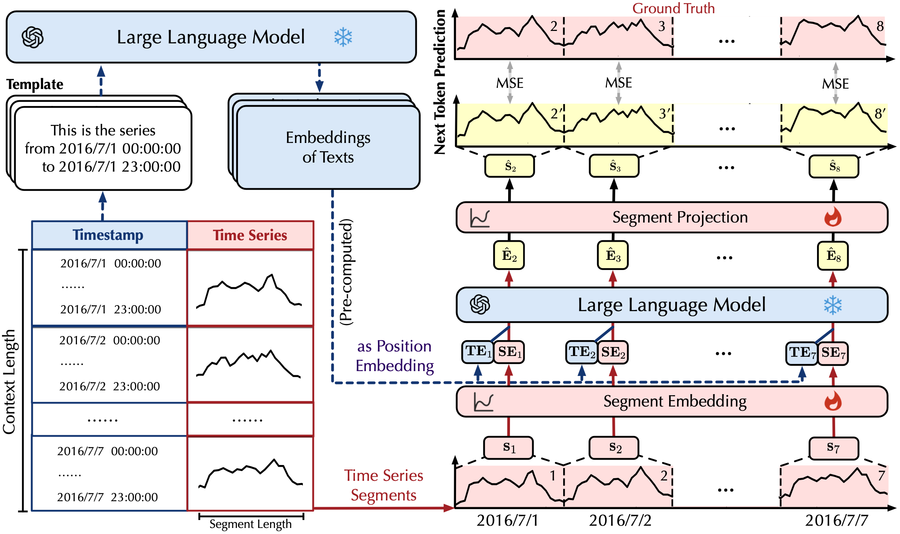
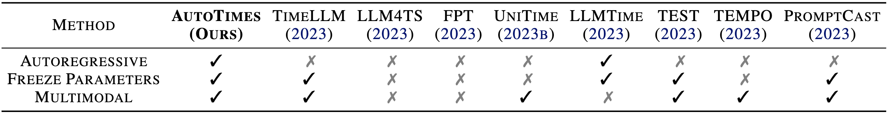
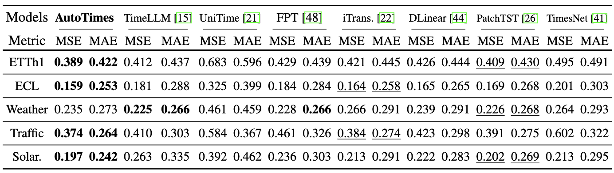
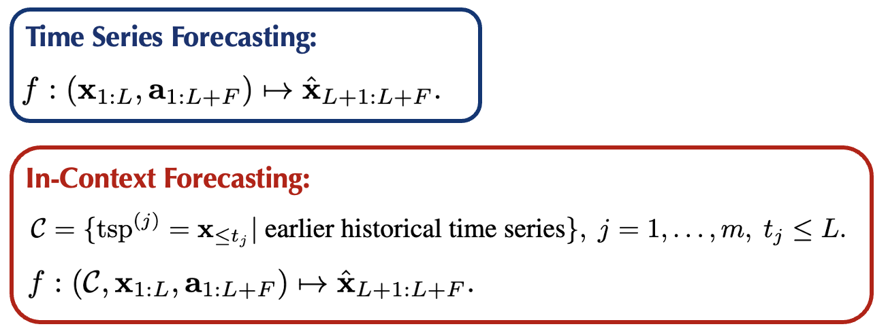
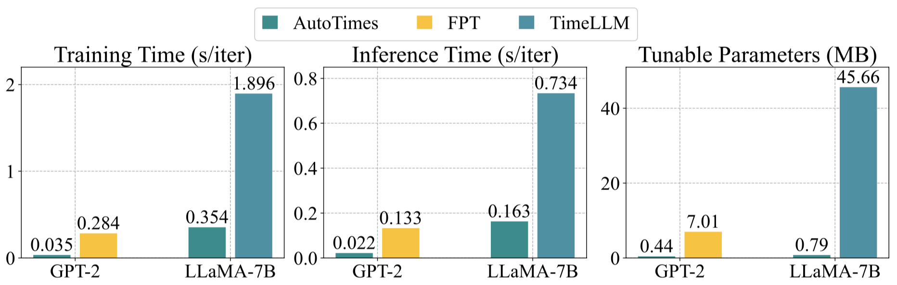
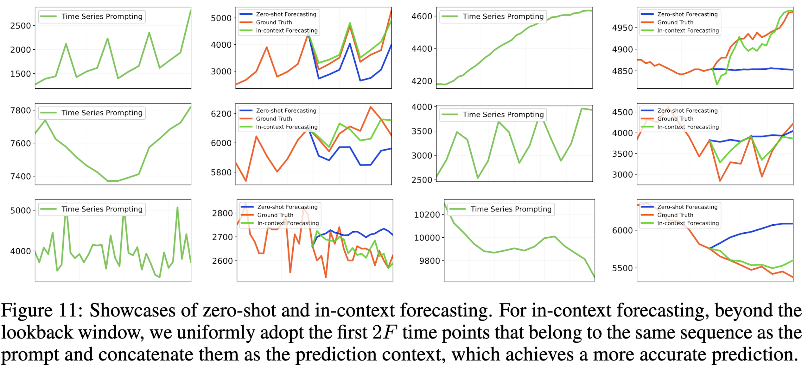
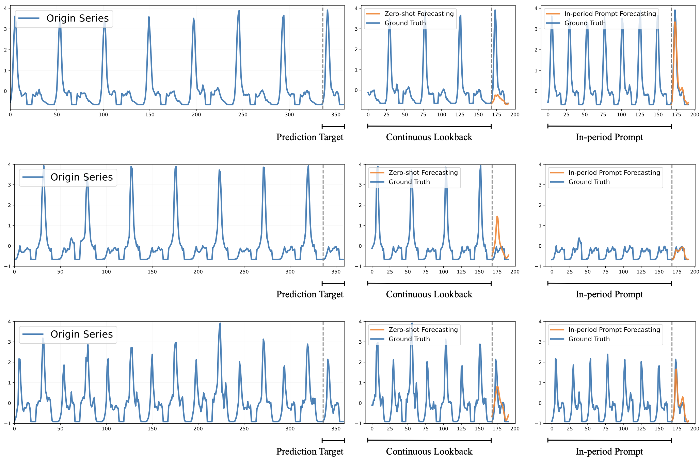

# AutoTimes (大语言模型时间序列预测)

官方实现：[AutoTimes: 通过大语言模型实现自回归时间序列预测](https://arxiv.org/abs/2402.02370)。[[幻灯片]](https://cloud.tsinghua.edu.cn/f/7689d30f92594ded84f0/), [[海报]](https://cloud.tsinghua.edu.cn/f/f2c18ae34fef4e74ad46/)


> **[时间序列预测](./scripts/time_series_forecasting/)**: AutoTimes 将大语言模型转换为自回归时间序列预测器。与以往方法不同，该预测器可以适应任意长度的回顾和预测。

> **[零样本预测](./scripts/zero_shot_forecasting/)**: AutoTimes 利用大语言模型通用目的的标记转换作为时间序列的未来外推，在没有下游样本的情况下表现出良好的性能。

> **[上下文预测](./scripts/in_context_forecasting/)**: 我们首次提出上下文预测，其中时间序列提示可以纳入输入上下文以增强预测效果。

> **[条件前缀](./models/prefix.py)**: 动态前缀调整，根据时间模式、统计数据和外部因素等上下文特征调整大语言模型行为，以改进非平稳时间序列预测。

> **[易于使用](scripts/method_generality)**: AutoTimes 与任何仅解码器大语言模型兼容，展示了通用性和适当的扩展行为。

## 更新

:triangular_flag_on_post:  新闻  (2025.01): **条件前缀**功能已实现！AutoTimes 现在支持使用 MLP、Pool 和 Hybrid 模式的条件前缀调整，以改进时间序列预测性能。

:triangular_flag_on_post:  新闻  (2024.10): 我们的工作介绍可在 [[幻灯片]](https://cloud.tsinghua.edu.cn/f/7689d30f92594ded84f0/) 中获取。**NeurIPS 2024** 见！

:triangular_flag_on_post:  新闻  (2024.10): AutoTimes 已被 **NeurIPS 2024** 收录。[修订版本](https://arxiv.org/pdf/2402.02370)（**25 页**）现已可用，包括上下文预测的提示工程、适应成本评估、元数据的文本嵌入和低秩适应技术。

:triangular_flag_on_post:  新闻  (2024.08): [近期工作](https://arxiv.org/abs/2406.16964) [(代码)](https://github.com/bennytmt/ts_models) 也对之前的非自回归 LLM4TS 方法提出了质疑。我们在此进行消融实验 [here](./figures/ablation_llm.png)，突出显示 AutoTimes 可以真正利用大语言模型。与采用 BERT 风格的大语言模型不同，**通用目的的标记转换可以在时间序列和自然语言之间转移**。

<p align="center">

</p>

:triangular_flag_on_post: **新闻** (2024.2) 我们[论文](https://arxiv.org/pdf/2402.02370.pdf)中上述任务的脚本都已可用。

## 介绍

🌟 虽然流行的 LLM4TS 方法将大语言模型调整为仅编码器和非自回归预测器，我们提出**保持与固有的自回归属性和模型架构一致**。

<p align="center">

</p>

💪 我们旨在**充分 revitalize 大语言模型作为时间序列预测的基础模型**，包括多步预测、零样本能力、**上下文预测**和多模态利用。

🏆 AutoTimes 以**0.1% 可训练参数和超过 5× 训练/推理加速**实现了**最先进的性能**，相比先进的基于大语言模型的预测器。

## 使用方法

1. 安装 PyTorch 和必要的依赖项。

```
pip install -r requirements.txt
```

2. 将数据集 [[Google Drive]](https://drive.google.com/file/d/1t7jOkctNJ0rt3VMwZaqmxSuA75TFEo96/view?usp=sharing)
[[Tsinghua Cloud]](https://cloud.tsinghua.edu.cn/f/0a758154e0d44de890e3/) 放入 ```./dataset/``` 文件夹下。

3. 从 [Hugging Face](https://huggingface.co/) 下载大语言模型。默认大语言模型是 LLaMA-7B，您可以在 `run.py` 中更改 `llm_ckp_dir` 以使用其他大语言模型。
   * [LLaMA-7B](https://huggingface.co/meta-llama/Llama-2-7b)
   * [OPT 系列](https://huggingface.co/facebook/opt-125m)
   * [GPT2](https://huggingface.co/openai-community/gpt2)

   例如，如果您成功下载并放置 LLaMA 目录，目录结构如下：
   - data_provider
   - dataset
   - llama
     - config.json
     - pytorch_model-00001-of-00002.bin
     - pytorch_model-00002-of-00002.bin
     - ...
   - ...
   - run.py

4. 使用文本时间戳的位置嵌入。请注意，我们在下载链接中提供了给定数据集的嵌入，这些嵌入由 LLaMA 生成，以 `{dataset_name}.pt` 为后缀。如果您想从自定义数据集生成嵌入，请参考以下代码：
```
# 预处理时间戳以生成文本嵌入
python ./preprocess.py --gpu 0 --dataset ETTh1
```

5. 训练和评估模型。我们在 ```./scripts/``` 文件夹下提供了所有上述任务。

```
# 默认大语言模型是 LLaMA-7B

# 长期预测
bash ./scripts/time_series_forecasting/long_term/AutoTimes_ETTh1.sh

# 短期预测
bash ./scripts/time_series_forecasting/short_term/AutoTimes_M4.sh

# 零样本预测
# 值得注意的是 sM4_tM3 利用在短期上训练的模型，
# 您应该先运行 AutoTimes_M4
bash ./scripts/zero_shot_forecasting/sM4_tM3.sh
bash ./scripts/zero_shot_forecasting/sM3_tM4.sh

# 上下文预测
bash ./scripts/in_context_forecasting/M3.sh

# 在其他大语言模型上尝试
bash ./scripts/method_generality/opt.sh

# 条件前缀预测（改进非平稳数据的性能）
bash ./scripts/time_series_forecasting/long_term/AutoTimes_ETTh1_conditional_prefix.sh
```

> 由于简单的标记化和大语言模型块的冻结，AutoTimes 与大语言模型高度兼容。例如，在单个 RTX 3090-24G 上，AutoTimes 将 LLaMA-7B 重新用于 ETTh1 只需要 **15 分钟**。

### 使用示例
请参阅 ```predict.ipynb``` 以获取简单的训练和推理工作流程。

## 整体方法

<p align="center">

</p>

## 对比

<p align="center">

</p>


## 时间序列预测

**一站式**基准：单个预测器在一个数据集上训练，随后用于所有预测长度。


<p align="center">

</p>

## 上下文预测

<p align="center">

</p>

受益于目标域的时间序列提示，AutoTimes 相比零样本预测实现了平均 **13.3%** 的 SMAPE 降低。

## 方法效率

<p align="center">

</p>

## 条件前缀

条件前缀通过基于时间序列数据的上下文特征调整大语言模型行为来增强 AutoTimes。这对于非平稳和突发时间序列特别有效。

### 功能特性
- **MLP 模式**：使用上下文特征运行时生成前缀
- **Pool 模式**：按时间粒度分组的预计算前缀池
- **混合模式**：结合池查找与 MLP 适应
- **上下文特征**：自动提取时间模式、统计数据和外部因素

### 使用方法
```bash
# 结构化条件Prefix Tuning
python run.py --use_prefix --prefix_length 16 --prefix_mlp_hidden 512 --freeze_llm_except_prefix

# 特点：
# - 使用结构化提示词模板（领域、统计信息、时间特征）
# - 结合数值统计特征和领域特定知识
# - 端到端训练，只更新Prefix参数
# - 支持ETT、Traffic、Weather等多领域数据集
```

### 优势
- 改进非平稳时间序列的性能
- 更好地处理突发事件和异常
- 最少的额外参数（< 0.1% 的大语言模型参数）
- 与所有 AutoTimes 模式兼容

## 案例展示
我们研究了不同的提示检索策略。提供了有洞察力的结果，以揭示使用时间序列提示对交互式预测的影响。

<p align="center">

</p>

<p align="center">

</p>

## 引用

如果您发现这个仓库有帮助，请引用我们的论文。

```
@article{liu2024autotimes,
  title={AutoTimes: 通过大语言模型实现自回归时间序列预测器},
  author={Liu, Yong and Qin, Guo and Huang, Xiangdong and Wang, Jianmin and Long, Mingsheng},
  journal={arXiv preprint arXiv:2402.02370},
  year={2024}
}
```

## 致谢

我们非常感谢以下 GitHub 仓库的宝贵代码和努力。
- Time-Series-Library (https://github.com/thuml/Time-Series-Library)
- FPT (https://github.com/DAMO-DI-ML/NeurIPS2023-One-Fits-All)

## 联系方式

如果您有任何问题或想使用代码，请随时联系：
* Yong Liu (liuyong21@mails.tsinghua.edu.cn)
* Guo Qin (qinguo24@mails.tsinghua.edu.cn)
